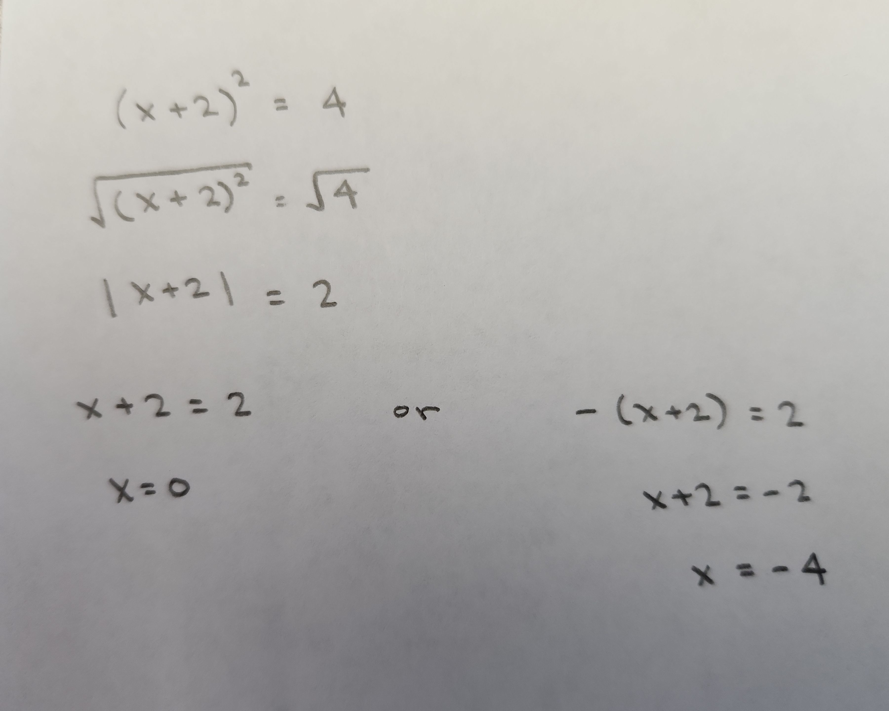

```{r setup, include=FALSE}
knitr::opts_chunk$set(echo = TRUE)
```

Given a function $f(x)=x^2$ and funtion $h(x) = f(x+2)$, we want to calculate the input for $h(x)$ when the output is 4.

Some things to notice about this calculation is that taking the square root of a squared quantity gives an absolute value, this leads to two inputs that are connected to the output 4 for the function $h$.
